#### Go语言核心编程
* go语言，简称Golang;
* Golang应用：区块链研发工程师、Go服务器端/游戏软件工程师、Golang分布式/云计算服务后台应用；golang的计算能力强
* 特点：
	1. 具有静态编译语言的安全和性能（如C），又达到了动态语言开发维护的高效率（如pyton）; go = C + python
	2. 从C语言中继承了很多理念，包括表达式语法，控制结构，基础数据类型，调用参数值，指针等
	3. 引入包的概念，用于组织程序结构，go语言的一个文件都要归属于一个包，而不能单独存在
	3. 垃圾回收机制，内存自动回收
	4. 天然并发，从语言层面支持大并发
	5. 吸收了管道通信机制，可以实现不同的goroute之间相互通信
	6. 函数返回多个值
	7. 新的创新，比如切片
* go语言开发工具：
	1. vs code 
	2. sublime text,使用一定次数以后就会提示到是否购买
	3. vim  
	4. Emacs传产中的神器，它不仅仅是一个编辑器，因为功能强大
	5. Eclipse IDE，需要安装GoEclipse插件
	6. LiteIDE,是一款真专门为Go语言开发的跨平台轻量级集成开发工具
	7. JetBrains公司的产品，PhpStorem webStorm等工具，需要安装Go插件
	8. [intellij idea+golang-plugin](https://www.cnblogs.com/clivelee/p/3870186.html)

* [MAC下搭建GO开发环境](https://blog.csdn.net/lovechris00/article/details/71178881?locationNum=4&fps=1)
* 开发步骤：
1. 目录结构,

````
 go文件的后缀是 .go; 
 package main表示该hello.go文件所在的包是main,在go中每个文件都必须归属于一个包；
  import "fmt"，表示引入了一个外，包名叫fmt，引入该包后，就可以使用它里面的函数,fmt.Println;
  fun是一个关键字，表示一个函数
  fmt.Println("hello")//调用fmt的Println
````

1. 通过go build对文件进行编译（环境变量必须安装正常）
1. 编译会生成目标文件，点击运行即可 或者 在终端执行 ./目标文件
2. 也可以在终端直接执行 go run 文件.go 运行

* GoLang执行流程分析：
	* 如果是对源码编译后，再执行，go的执行流程如下图：
	* 如果我们是对源码直接执行go run 源码，go的执行流程如下图：;在实际开发中，应该先编译，再运行
* 两种执行区别：
	1. 如果是先编译的，我们可以将编译出来的文件复制到其他没有go的环境的电脑运行
	2. 如果我们是直接go run go源码，需要在其他的电脑上面也需要go的开发环境
	3. 在编译时，编译器会将程序运行的依赖的库文件包含在可执行文件中，所以可执行文件变得大了很多

* Golang编译运行说明：	
##### Go语法要求和注意事项：
	1. go源文件以.go为扩展名
	2. go应用程序的执行入口是main函数
	3. go语言严格区分大小写
	4. go方法由一条条语句构成，每个语句后不需要分号
	5. go编译器是一行行进行编译的，因此我们一行就写一条语句，不能把多条语句写在同一行，否则会报错；
	6. go语言定义的变量或者import的包如果没有使用到，代码不能编译通过
	7. 大括号都是成对出现的，缺一不可；
		
##### Go的转义字符
* \t   制表
*  \n  换行
*  \\ 代表一个\
*  \" 一个"
*  \r 一个回车

##### Go开发常见错误和解决方法 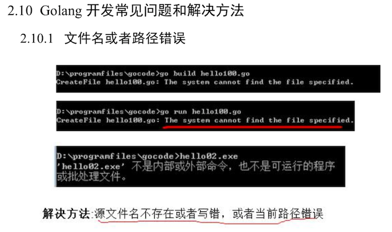
##### 注释
* 行注释  //
* 多行注释  /* */

##### Go核心编程_规范的代码风格要求
* 尽量用行注释
* 正确的缩进和空白：使用一次tab操作、或者使用gofmt来格式化、运算符两边习惯性各加一个空格、一行代码最长不超过80个字符，超过请使用换行展示，尽量保持格式优雅

##### [Go官方编程指南](https://golang.org/)需要要墙
* [离线文档查看方法](https://blog.csdn.net/ljfeng123/article/details/79095550)
##### Go核心编程_Go语言标准库API
* [中文版的API](https://studygolang.com/pkgdoc)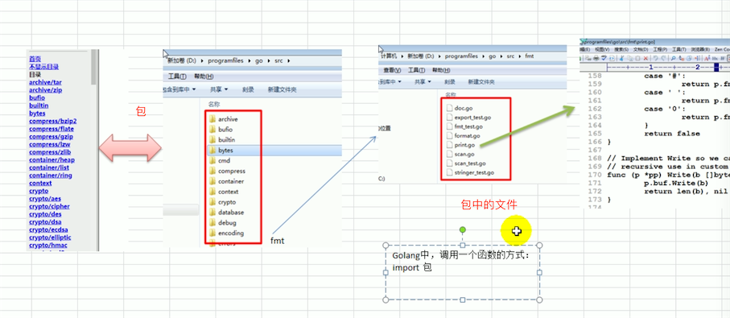

##### Go核心编程_Dos常用指令介绍
* 查看当前目录 dir
* 切换到其他盘下 cd /d f:   ，切换到F盘
* 切换到当前盘的其他目录 cd
* 切换到根目录 cd \
* 新建一个目录 md 目录名
* 删除目录  rd 目录
* 复制文件  copy abc.txt d:\test200  
* 移动文件  move abc.txt f:\
* 删除文件 del abc.txt
* 清屏 cls
* 退出 exit

##### Go语言变量的使用三种方式：
1. 指定变量类型，声明后若不赋值，使用默认值
2. 根据值自行判定变量类型
3. 省略var，注意： =左侧的变量不应该是已经声明过的，否则会导致编译错误
4. 多变量声明，有时候需要一次性声明多个变量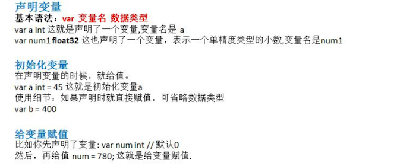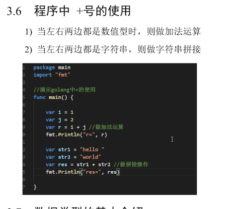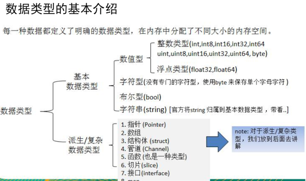

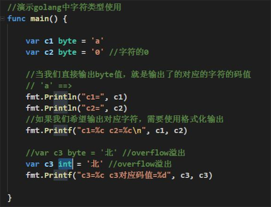
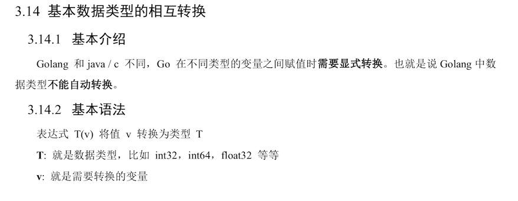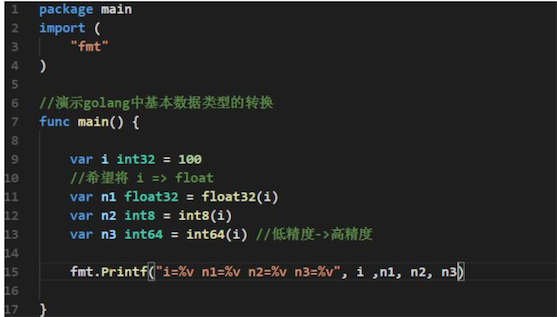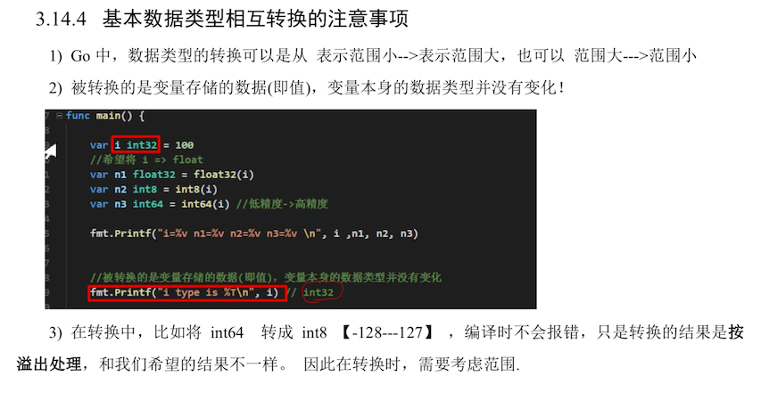
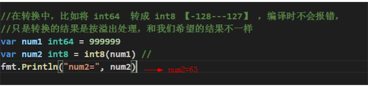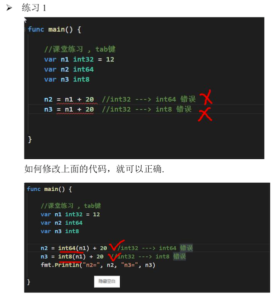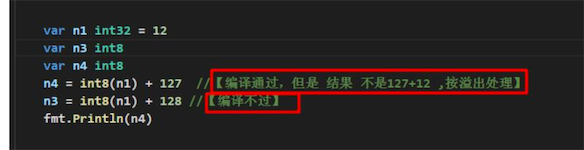
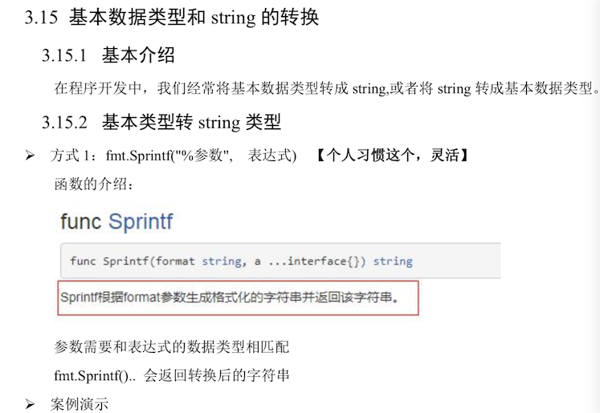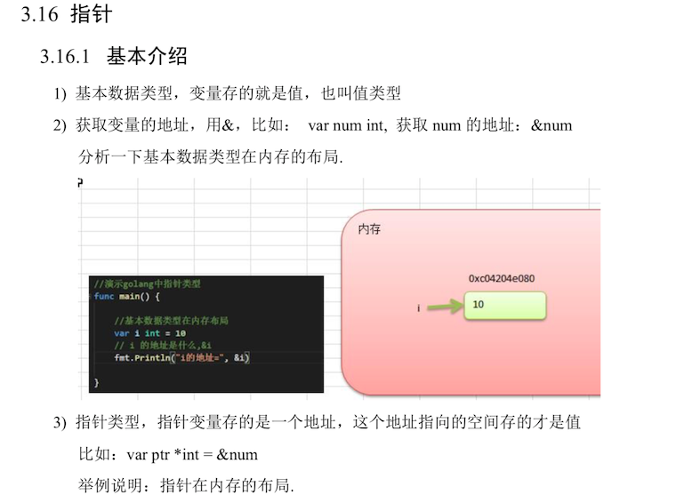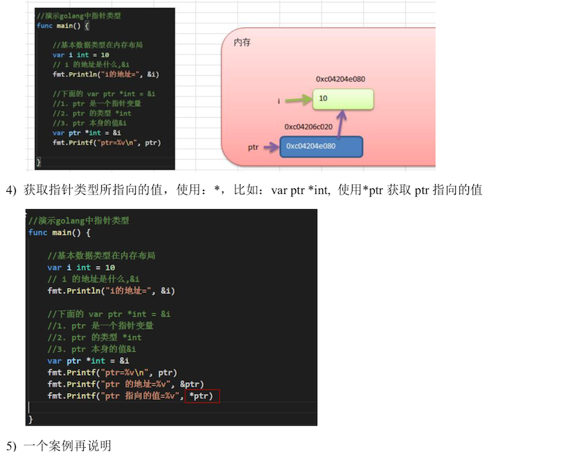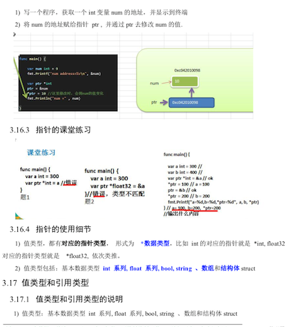

