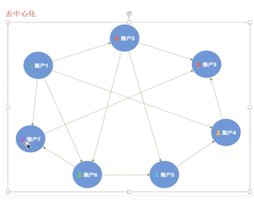
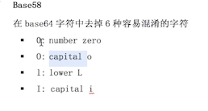
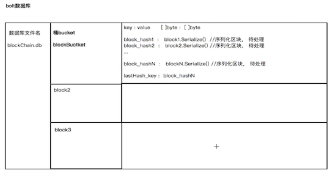
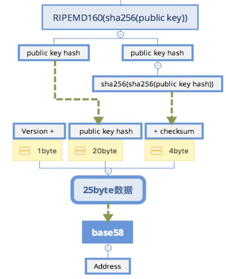
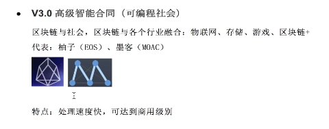

##### 比特币产生的背景
* 纸币的风险：通货膨胀、战乱、金融危机...
* 电子金融：银行卡、微信、支付
##### 比特币产生的背景
* 金融危机
* 技术储备：加密技术、网络技术、共识算法
* 密码朋克组织
* 为何适合做为金融货币
	* 不可重复花费，价值转移(UTXO)
	* 交易不可伪造（校验严格、工作量证明、无假币）
	* 可分性 1BT = 10^8
	* 通过挖矿来实现货币的货币
	* 货币数量2100w个，无通用风险 
* 中心化与去中心化
	*  中心化服务器： ，去中心化：

##### 比特币介绍
* 
* 区块是什么？记录多条交易的一页账单，,,每10分钟，生成一个区块，依次链接起来 ，形成一个链条；
* 比特币与区块链的关系：
* 比特币交易简单介绍：,在本地创建交易，通过P2P网络广播，竞争挖矿，

##### 比特币用到的基础知识
* 哈希算法(摘要算法)：不管输入多长数据，都输出长度16的字符串。可以用来验证交易，只要交易有一点点改变，出来的hash就会不一样；，哈希算法的特性：
* 密码学：对称加密与非对称加密
	* 对称加密： ,特点：
	* 非对称加密： 
* 编码：比特币的地址生成的时候用到base58技术
	*  ,共64个字符
* P2P（用于广播交易 同步账本）
	* 
* 梅克尔树（用于快速验证交易）
	* ,每个节点存储的是hash值
* 工作量证明:最先用于邮件系统反垃圾邮件（反邮件攻击）
* ，通过调整前面0的数量，来控制难度，

#### 比特币区块结构
* 
* 
*  coinbase没有支付人，只有收款人
* 

#### 比特币交易流程
* 

#### [代码相关](src)
##### bolt数据库
* [源码](https://github.com/boltdb/bolt)
* 原理  ，把数据放到桶里，由桶来维护。一个数据库文件可以有多个通；本地需要存储区块的数据，key:value => key = blolk_hash, value = bolck.Serialize(),每添加一个区块，就添加这样的一对数据；testHash_key:存储最后一个区块的hash(每次只需要读这个key,就可以拿到最后一个区块，而不需要遍历所有区块)

#### 比特币交易
* 地址,拿到公钥后，对公钥进行sh256哈希（得到20个字节），再对结果进行PIPEMD160哈希，再对结果两次256哈希
* 多种交易形式
* 
* 
* UTXO生成消耗过程 

#### 区块链是什么？
*  
* 区块链的发展阶段：

#### 区块链协议
 数据层(区块数据容量问题)->网络层（P2P）-> 共识层 -> 激励层（如何鼓励大家参数）-> 合约层（弥补比特币1.0的缺陷：栈模式、功能不完善） -> 应用层(DAPP:去中心化)

 
* POW(算力随机)特点：
* POS(钱的随机)
,根据持有货币的数量和天数为权重，随机选取人出来记账),根据币天为权重。利息就是记账奖励；

* DPOS
，所有节点投票，选出靠谱一个机构来记账；如：，每年会增发货币来奖励记账节点。如果候选节点发现记账节点搞假，就会把他踢出去，由候选人来记账；

* POW + POS混合模式 
* 