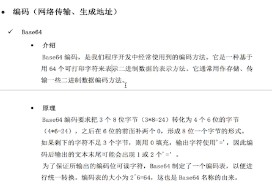

##### 比特币产生的背景
* 纸币的风险：通货膨胀、战乱、金融危机...
* 电子金融：银行卡、微信、支付
##### 比特币产生的背景
* 金融危机
* 技术储备：加密技术、网络技术、共识算法
* 密码朋克组织
* 为何适合做为金融货币
	* 不可重复花费，价值转移(UTXO)
	* 交易不可伪造（校验严格、工作量证明、无假币）
	* 可分性 1BT = 10^8
	* 通过挖矿来实现货币的货币
	* 货币数量2100w个，无通用风险 
* 中心化与去中心化
	*  中心化服务器： ，去中心化：

##### 比特币介绍
* 
* 区块是什么？记录多条交易的一页账单，,,每10分钟，生成一个区块，依次链接起来 ，形成一个链条；
* 比特币与区块链的关系：
* 比特币交易简单介绍：,在本地创建交易，通过P2P网络广播，竞争挖矿，

##### 比特币用到的基础知识
* 哈希算法(摘要算法)：不管输入多长数据，都输出长度16的字符串。可以用来验证交易，只要交易有一点点改变，出来的hash就会不一样；，哈希算法的特性：
* 密码学：对称加密与非对称加密
	* 对称加密： ,特点：
	* 非对称加密： 
* 编码
	*  ,共64个字符