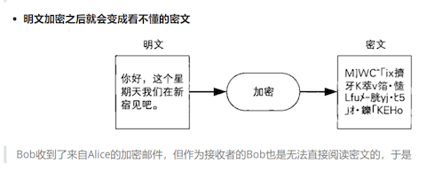
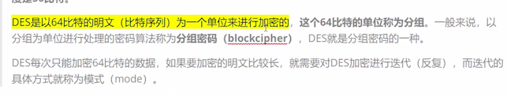

#### 大纲
*   
*

* 对称加密：
* 
* DES
* 现在DES也不是那么安全了，因为计算机越来越快了；
* DES细节：
* 

 
* [DES加解密代码](code/Ctypto)
* 

### AES
*  ,对称加密中，现阶段安全级别最高的加密算法 
*  ,新项目如果要用对称加密，建议使用AES加密算法

### 非对称加密
* 对称加密存在密钥分发困难，分发密钥的时候，可能被对方监听到。因而有了非对称加密
*  ,只有Bob能解密数据，Alice可以用公钥向Bob发送数据.非对称加密只需要向对方分发公钥就OK了
* 

* [非对称加解密demo](code/Ctypto/MyRsa.go)
* ,密钥越长，程序运行的时间越长，效率越低
* 